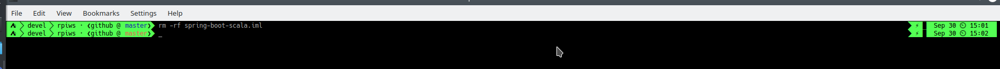

# Awesome Terminal
A collection of small scripts to render bash (in future, zsh as well) shells that pretty prints informations such as the
current working directoy, git repo status (clean/dirty), battery status, date and time.

Inspired by [Awesome Terminal Fonts](https://github.com/gabrielelana/awesome-terminal-fonts).. however, until now I wasn't
able to make them work properly in all cases (sometimes they need more spacing, otherwise regular characters will be
rendered on top of them. Perhaps I should switch to zsh completely. See tentative fix in ```awesome_terminal.sh``` .


or



# Installation
Installing Awesome Terminal is easy: you need to edit your ```~/.bashrc``` and, at the very end, append the following line:

> source /path/of/cloned/repository/awesome_terminal.sh

After that, open a new terminal session and you're good to go :)

## Changing Theme
Simply edit

> /path/of/cloned/repository/awesome_terminal.sh

and change the following line

> source ${AT_BASE_DIR}/themes/crumby.grayscale.sh

in order to pickup the theme you prefer.

# Theme development
Themes can be customized and expanded fairly easily: you can start by tweaking the background/foreground colors to fit
your tastes, change the symbols used for example for ```home/<username>``` etc...

Should you really change the way things are assembled and displayed for the current path, dvcs, battery and date
informations, you can override the method ```cwd_detect``` , ```dvcs_detect``` or ```battery_detect``` in your theme file,
for a finer-grained control.
